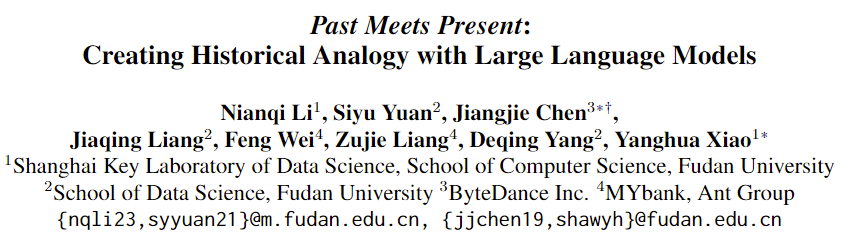

# Historical-Analogy-of-LLMs

Resources for our paper: Past Meets Present: Creating Historical Analogy with Large Language Models

## Overview
Historical analogies, which compare known past events with contemporary but unfamiliar events, are important abilities that help people make decisions and understand the world.
However, research in applied history suggests that people have difficulty finding appropriate analogies. 
And previous studies in the AI community have also overlooked historical analogies.
To fill this gap, in this paper, we focus on the **historical analogy acquisition** task, which aims to acquire analogous historical events for a given event.
We explore retrieval and generation methods for acquiring historical analogies based on different large language models (LLMs).
Furthermore, we propose a self-reflection method to mitigate hallucinations and stereotypes when LLMs generate historical analogies.
Through human evaluations and our specially designed automatic multi-dimensional assessment, we find that LLMs generally have a good potential for historical analogies. 
And the performance of the models can be further improved by using our self-reflection method.

## File Descriptions
### 1. Python Scripts
- framework
  - retrieval-based
    - **`direct_retrieval.py`**: Using cosine similarity of descriptions to obtain analogies directly from the event pool
    - **`twostage_retrieval.py`**: Get the candidate set from the event pool first, and use the LLMs to select the analogies
    - **`llm_tools.py`**: Tools for calling LLMs, including text-embedding-3-small, gpt-3.5-turbo, gpt4 and gemini
  - generation-based
    - **`direct_generation.py`**: LLMs directly output analogous results
    - **`twostage_generation.py`**: LLMs present candidate sets before selecting analogous results
    - **`summary_generation.py`**: Improvements in twostage generation require that the description be summarized
    - **`reflection_generation.py`**: Add self-reflection process to reflect and rewrite for unsuitable candidate sets
    - **`llm_tools.py`**: Tools for calling LLMs, including gpt-3.5-turbo, gpt4 and gemini
- **`evaluation.py`**: Automated evaluation with pass@1 and multi-dimensional similarity metrics

### 2. Dataset
**`event_pool.jsonl`** is a collection of 658 historical events from Google Arts and Culture. **`general_analogy.jsonl`** is a subset of **`event_pool.jsonl`** and contains general historical events for which historical analogies need to be found. **`popular_analogy.jsonl`** is a manual collection of famous historical analogies from the web and articles with reference answers.

## Ethics Statement
### Use of Human Annotations
Evaluation on the identified historical analogies from LLMs is implemented by three annotators recruited by our institution. The construction team remains anonymous to the authors. 
We ensure that the privacy rights of all annotators are respected throughout the annotation process. 
All annotators are compensated above the local minimum wage and consent to the use of these historical analogies for research purposes, as described in our paper. 

### Risks
The analogy sets used in the experiment, including the popular and general sets, are derived from publicly accessible sources.
We have reviewed these analogies to ensure they are free from socially harmful or toxic language. 
However, we cannot guarantee that they will not offend certain groups. 
Furthermore, evaluating historical analogies depends on common sense, and individuals from diverse backgrounds may have different perspectives. 
